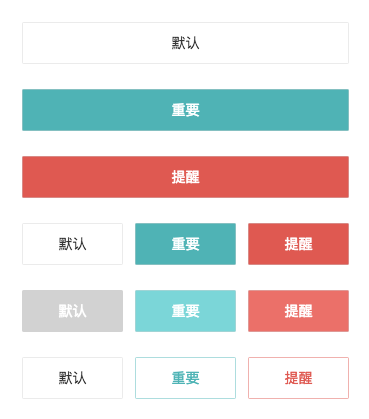
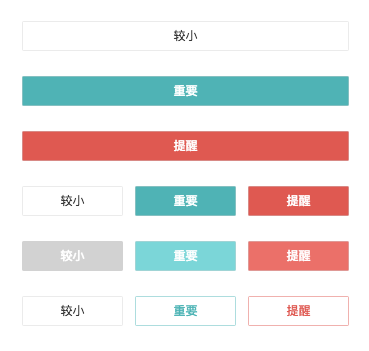
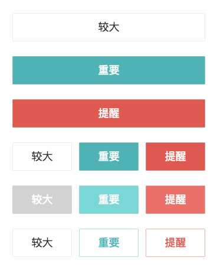

## API

| 参数 | 说明 | 类型 | 默认值 |
| :------| ------: | :------: | :------: |
| size | 设置按钮大小，可选值为 small large 或者不设 | string | '' |
| type | 设置按钮类型，可选值为 primary warning 或者不设 | string | '' |
| block | 设置按钮为 block 类型，group 下自动为 block 类型 | boolean | true |
| plain | 使按钮背景透明 | boolean | false |
| disabled | 是否禁用按钮 | boolean | false |
| onClick | 按钮的点击事件 | function | -- |


## Usage

#### 默认尺寸

> 预览



> 代码

```
const Buttons = () => {
  return (
    <div>
      <section>
        <Button>默认</Button>
        <br />
        <Button type="primary">重要</Button>
        <br />
        <Button type="warning">提醒</Button>
      </section>
      <br />

      <ButtonGroup>
        <Button>默认</Button>
        <Button type="primary">重要</Button>
        <Button type="warning">提醒</Button>
      </ButtonGroup>
      <br />

      <ButtonGroup>
        <Button disabled>默认</Button>
        <Button disabled type="primary">重要</Button>
        <Button disabled type="warning">提醒</Button>
      </ButtonGroup>
      <br />

      <ButtonGroup>
        <Button plain>默认</Button>
        <Button plain type="primary">重要</Button>
        <Button plain type="warning">提醒</Button>
      </ButtonGroup>
    </div>
  )
}
```

#### 较小尺寸

> 预览



> 代码

```
const Buttons = () => {
  return (
    <div>
      <section>
        <Button size="small">较小</Button>
        <br />
        <Button size="small" type="primary">重要</Button>
        <br />
        <Button size="small" type="warning">提醒</Button>
      </section>
      <br />

      <ButtonGroup>
        <Button size="small">较小</Button>
        <Button size="small" type="primary">重要</Button>
        <Button size="small" type="warning">提醒</Button>
      </ButtonGroup>
      <br />

      <ButtonGroup>
        <Button disabled size="small">较小</Button>
        <Button disabled size="small" type="primary">重要</Button>
        <Button disabled size="small" type="warning">提醒</Button>
      </ButtonGroup>
      <br />

      <ButtonGroup>
        <Button plain size="small">较小</Button>
        <Button plain size="small" type="primary">重要</Button>
        <Button plain size="small" type="warning">提醒</Button>
      </ButtonGroup>
    </div>
  )
}
```

#### 较大尺寸

> 预览



> 代码

```
const Buttons = () => {
  return (
    <div>
      <section>
        <Button size="large">较大</Button>
        <br />
        <Button size="large" type="primary">重要</Button>
        <br />
        <Button size="large" type="warning">提醒</Button>
      </section>
      <br />

      <ButtonGroup>
        <Button size="large">较大</Button>
        <Button size="large" type="primary">重要</Button>
        <Button size="large" type="warning">提醒</Button>
      </ButtonGroup>
      <br />

      <ButtonGroup>
        <Button disabled size="large">较大</Button>
        <Button disabled size="large" type="primary">重要</Button>
        <Button disabled size="large" type="warning">提醒</Button>
      </ButtonGroup>
      <br />

      <ButtonGroup>
        <Button plain size="large">较大</Button>
        <Button plain size="large" type="primary">重要</Button>
        <Button plain size="large" type="warning">提醒</Button>
      </ButtonGroup>
    </div>
  )
}
```
